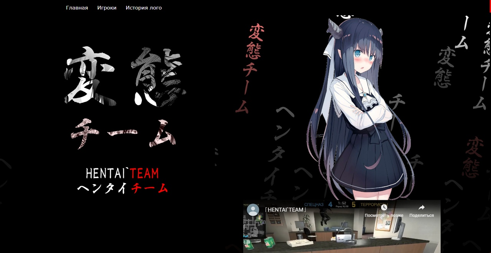
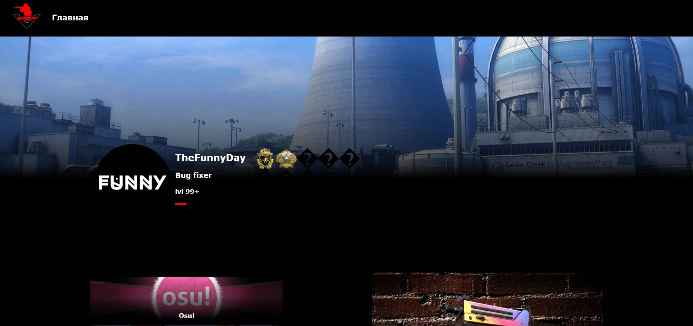
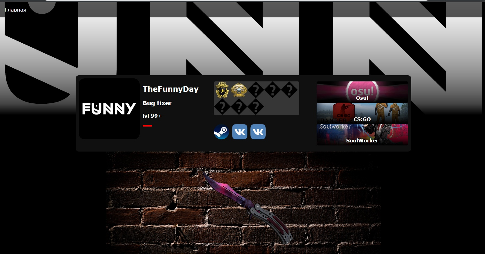
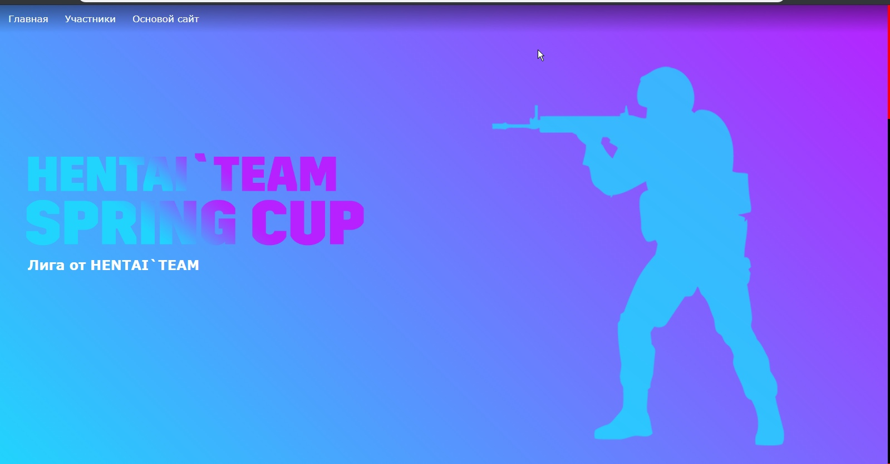

---

---

# HTEAM

This was one of my first websites. 

It was created in 2018 and became my second website. The site was made for my CS:GO team.

::: info
"HTeam" is not the original name of the website. The real original name can be found on the [site](https://ngoldprojects.github.io/hteam/hteam.html) itself.
:::

## Short story 
Back in the day, my friends and I absolutely loved playing CS:GO, especially on FACEIT. Even before we started thinking about creating a team (around 2018, if I remember correctly), I already had some experience in web development. (I can’t say I was very good at it at the time, but for a beginner, I think I did pretty well.) In particular, I created a website called ["SB"](/about/sb.md) (also known as "SedmoiBe" or "Seventh B" in English), which I managed entirely on my own.

My idea was for the website to contain information about the team and its players: links to their Steam profiles, favorite games, favorite CS:GO skins, and much more. Most of these ideas were successfully implemented, and I created a one-page website for an upcoming [tournament](https://ngoldprojects.github.io/hteam/httournaments.html).

After our team disbanded in 2019/2020, I decided to restore some of the project’s historical value by bringing the website back as a pleasant memory.

## A few screenshots of the old "HTeam"

<!-- Warns? -->

