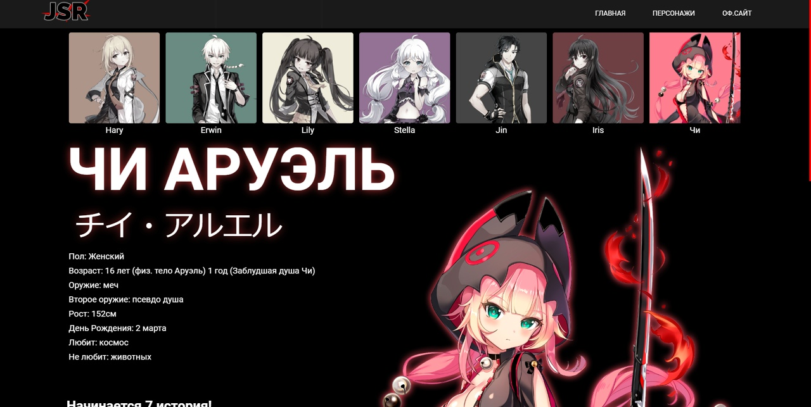
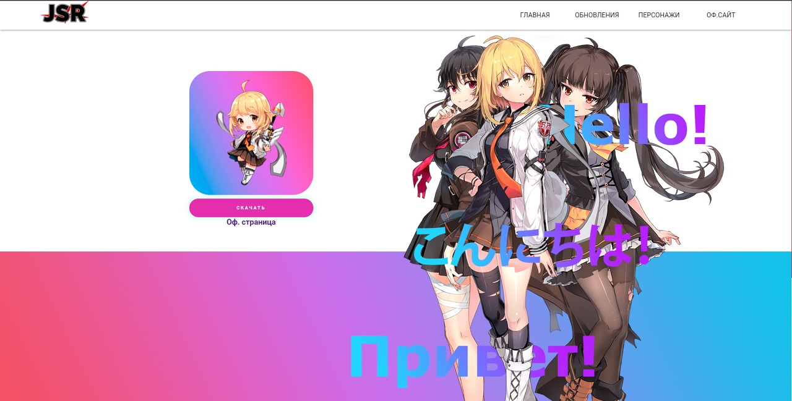
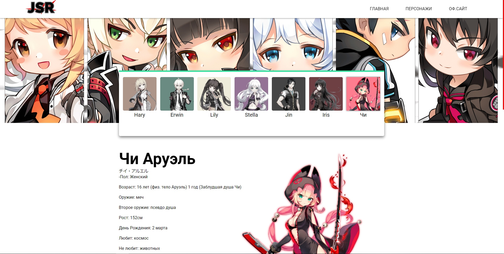

---

---

# JSR (Japanese SoulWorker in Russian)

This project was originally conceived as a kind of Wikipedia for the game "SoulWorker", but it never came to fruition. A lot of work was planned, but it never reached full implementation.

::: danger NOT READY
The redesign of the website is still in progress. Please stay tuned for updates!
:::

## Short Story

I loved playing SoulWorker. I first heard about this game on Steam. At that time (around 2018), the European version of the game was available on Steam and updates were released slowly for this version, always behind the Japanese and Korean versions. Since the Japanese version was easier to access, I switched to that. 

At first, I played without a translator, and it was difficult to understand the storylines of new characters and descriptions of items and skills. So, I decided to create my own wiki on the game where everything could be read in Russian. Later, I planned to create an English version as well, but, from the above text, you can probably understand that the project eventually failed due to "many plans but little desire". 

It was a great idea, but at that point in time, it was too difficult for me.Now, there is no need for this, as the global version of the game has already been released on Steam, where everything is in English.

::: warning
Most of the text has been done with the help of an online translator. If you notice an error, please [go here](https://github.com/NGoldprojects/NGoldprojects.github.io/issues) and report the issue.
:::

## A few screenshots of the old "JSR"

<!-- Warns? -->

