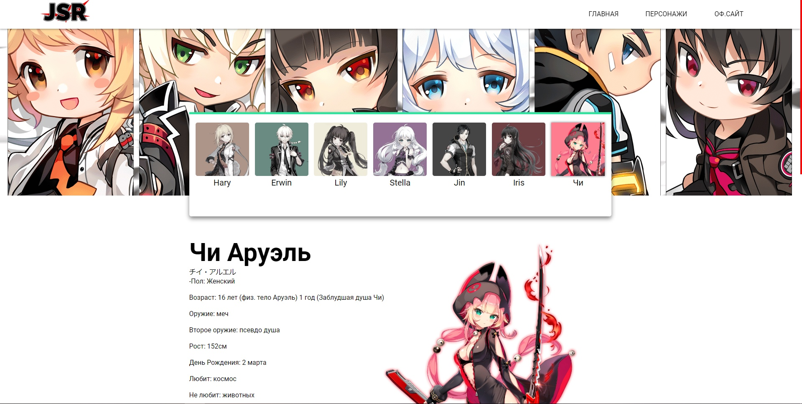

---

---

# JSR (Japanese SoulWorker in Russian)

This project started as a community-driven wiki for [SoulWorker](https://en.wikipedia.org/wiki/SoulWorker).

I had a lot of ideas and plans for it, but most of them never made it beyond the planning stage.

::: danger NOT READY
The redesign of the website is still in progress. Please stay tuned for updates!
:::

## Short Story

I used to be a huge fan of [SoulWorker](https://en.wikipedia.org/wiki/SoulWorker) and played it regularly between 2018 and 2020. Back then, the European version was available on Steam with English support, but updates were released much later than on the Japanese and Korean servers. Because of that, I eventually switched to the Japanese server.

The idea behind this Russian [SoulWorker](https://en.wikipedia.org/wiki/SoulWorker) project came from a simple problem: the game was in Japanese. While there was a translation patch available, it didn't cover everything. Understanding the story, item descriptions, and various game mechanics could be difficult at times. So I thought it would be useful to create a wiki that could help other players who were in the same situation.

It was a fun idea, but looking back, it was far too ambitious for me at the time. I started the project in 2018, and building and maintaining a complete game wiki turned out to be a much bigger task than I expected.

Today, a project like this is no longer really needed. The European server has shut down, and a global server has taken its place. Updates are now released alongside the Japanese server, and the game has proper English support, making information much more accessible than it was back then.

The game itself has also seen a significant decline in popularity, with a much smaller player base than during its peak years. Combined with the availability of English resources, this has made a dedicated Russian [SoulWorker](https://en.wikipedia.org/wiki/SoulWorker) wiki far less relevant than it once seemed.

## A few screenshots of the old "JSR"

<!-- Warns? -->

